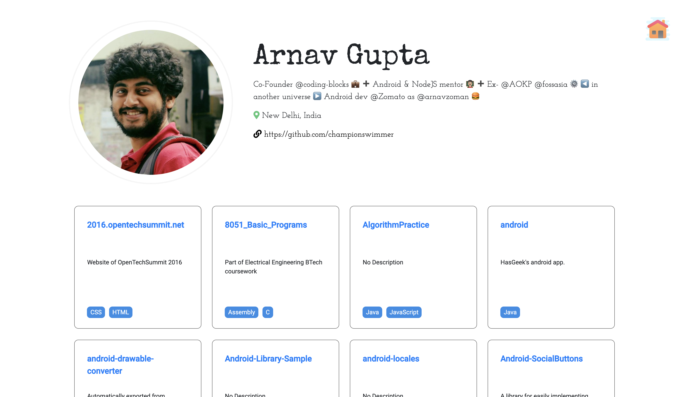

# GitHub Repository Listing Assessment

This project was made for Fyle Internship Assessment by Leo Adlakha. 

## Modifications and Assumptions

- Default Size Taken - 20 ( for symmetric design purposes ).
- Modified the design a little to accomadate 4 repositories in a row in the grid layout.

# GithubRepoListing

This project was generated with [Angular CLI](https://github.com/angular/angular-cli) version 12.2.6.

## Development server

Run `ng serve` for a dev server. Navigate to `http://localhost:4200/`. The app will automatically reload if you change any of the source files.

## Code scaffolding

Run `ng generate component component-name` to generate a new component. You can also use `ng generate directive|pipe|service|class|guard|interface|enum|module`.

## Build

Run `ng build` to build the project. The build artifacts will be stored in the `dist/` directory.

## Running unit tests

Run `ng test` to execute the unit tests via [Karma](https://karma-runner.github.io).